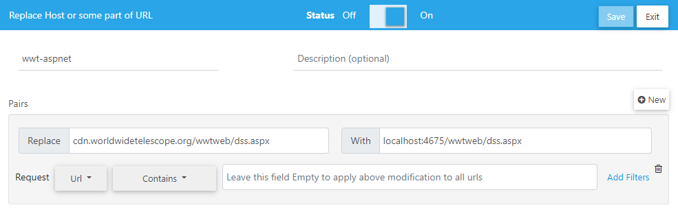
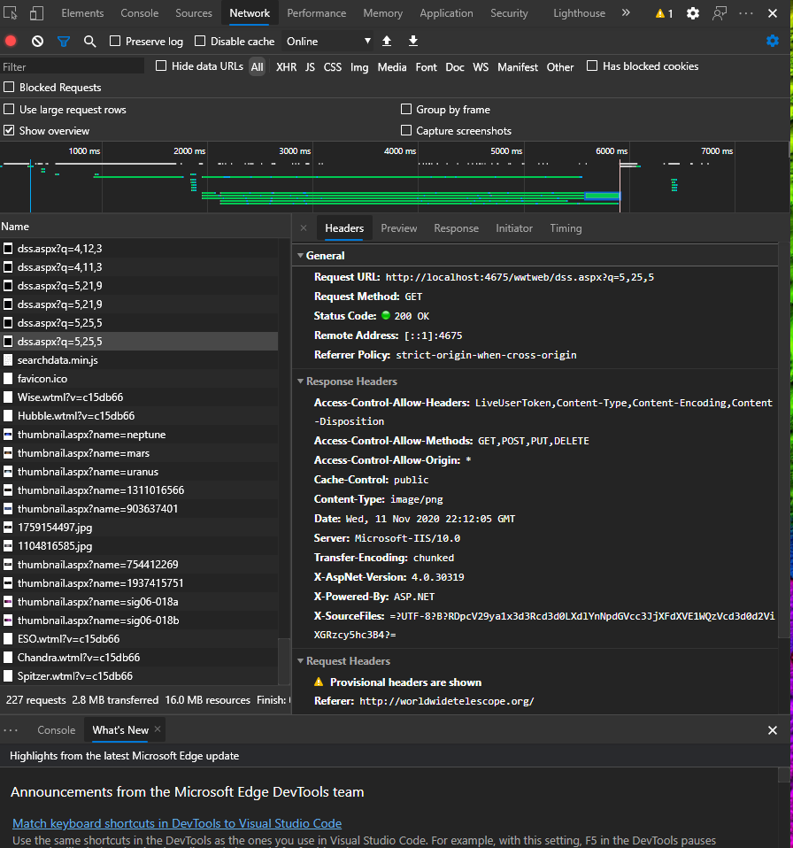

# Dev Environments

To see a list of technologies that this project uses, see [here](technologies.md).

This project is heavily data-driven with massive backend datastores of astronomical data. It is not reasonable to require full datasets to work on the service as it can take days to copy the full sets. Thus, we will outline some ways to test the service locally.

## Required tools

- [Visual Studio 16.8](https://visualstudio.microsoft.com/) with the ASP.NET and the .NET Core workloads installed. Community edition will work just fine.
- [Azure Storage Explorer](https://azure.microsoft.com/en-us/features/storage-explorer/)

There is work towards moving this to .NET 5. Once that lands, the service will not be tied to Windows or Visual Studio.

The solution file is `wwt-website.sln` and the start up project should be set to `WWTMVC5`.

## Set up development datasets

### Download datasets
A subset of data can be accessed by calling `GET http://worldwidetelescope.org/wwtweb/data/dev`. This is a zip file that will contain various datapoints and will be expanded as more deve data comes online. Each of the folders align with the expected Azure container it will be put in. Once the dataset is downloaded, the data should be copied over to either Azure or an Azure emulator such as Azurite.

### Azure Storage Emulator
This project is configured to use [Azurite](https://docs.microsoft.com/en-us/azure/storage/common/storage-use-azurite), a cross-platform emulator for Azure storage. There are multiple ways to acquire the tool, so please refer to the link given to set up an install.

Access to the storage is done via the `DefaultAzureTokenCredential` that requires `https` protocol for connection. In order to do that, the following steps must be done to enable development:

These are steps taken from [here](https://blog.jongallant.com/2020/04/local-azure-storage-development-with-azurite-azuresdks-storage-explorer/):

1. Install [`mkcert`](https://github.com/FiloSottile/mkcert#installation)
1. Trust the mkcert RootCA.pem and create a certificate

	```
	mkcert -install
	mkcert 127.0.0.1
	```
1. Chose a directory from which to run Azurite. The local emulator data will be stored here
1. Run Azurite with oauth and SSL support:

	```
	azurite --oauth basic --cert 127.0.0.1.pem --key 127.0.0.1-key.pem
	```
1. The app will now run with default settings.

In order to configure the [Azure Storage Explorer](https://azure.microsoft.com/en-us/features/storage-explorer/) to run, you'll need to do the following:

1. Get the RootCA.pem

	```
	mkcert -CAROOT
	```
1. Open Azure Storage Explorer
1. Go to `Edit->SSL Certificates->Import Certificates` and select the file from the first step.
1. Restart the storage explorer (you will be prompted to do this)

### Hit an endpoint with the developer dataset
In order to verify that the dataset is set up correctly, you should be able to `GET /wwtweb/dss.aspx?Q=0,0,0` to verify that it will be served up. Be careful that the service does not verify that the level you request is actually available - it expects specific levels to be there. Use this as a simple verification step or to run specific manual steps.

## Run service against live webclient
Besides hitting endpoints individually, the webclient can be used to test the service. There is no endpoint that says where the client starts, so the easiest way to do this is to intercept the requests. The default dataset is `dss.aspx`, the data for which should be obtained from the developer dataset.

In order to set this up, we need a way to rewrite requests so that they will be serviced elsewhere. For purposes of this example, we will show it using [requestly.io](https://requestly.io/) which can be added as an extension to enable this. For now, only the `dss.aspx` will be available for testing, so it will be highlighted here. In the future, other datasets may be available for testing as well. Please file any issues if there are specific datasets you need to be able to test.

1. Set up Requestly rules
    Requestly.io uses rules to rewrite requests from websites. The call we want to intercept is to the `dss.aspx` endpoint, which we can do by setting up rules similar to:
  

1. Open browser and its developer tools
1. Load webclient by going to http://worldwidetelescope.org
1. Inspect the network call results to see the calls to the local service such as below:
  

## Next steps for developers
Here are some of the potential next steps to investigate to simplify the development process:

1. Update clients to be data driven from an endpoint on the service
  Currently, the clients have a bunch of hardcoded expectations around what datasets are available and what it should be doing. By exposing an endpoint that provides an initial WTML or some other file of what the initial screen looks like, the client can react more easily to changes in available datasets and don't need to be updated. The service becomes the source of truth for this.
1. Consolidate the platefile related endpoints to be a single endpoint that takes a desired plate
  Currently, there are a number of endpoints that all do roughly the same thing: take coordinates and return images from a plate file. This is difficult to maintain and difficult to extend. This could potentially be combined to use a single endpoint, ie `/api/plate/{name}/{level}/{x},{y}` that could be completely data driven. Some thoughts here:
    - Can use rewriting tools to maintain current endpoints and have them end up there.
    - After the move to .NET 5, this can be much more easily done via controllers which will handle parameter binding
    - The available plates could be a dynamic list generated by searching the available files in the container
1. Levels can be calculated given a plate file, so a more data driven approach could calculate the available levels and dynamically adjust from the small develop plate files to the large plate files available in production.
1. The access to Azure could be abstracted to use the `IFileProvider` implementations that can compose from multiple locations. That way, a local dev could very easily use a file system, while the deployed system would use an Azure Blob backed file provider.
1. If the app were deployed to a container, dev data could be used for client development also without needing access to the internet or the public service.